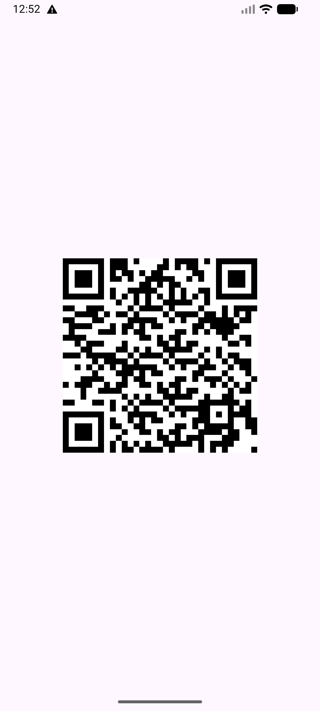
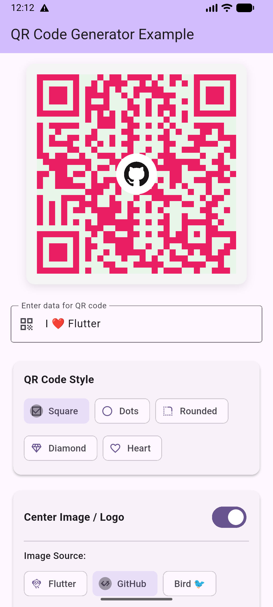
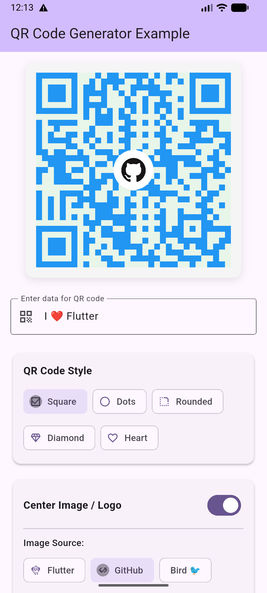
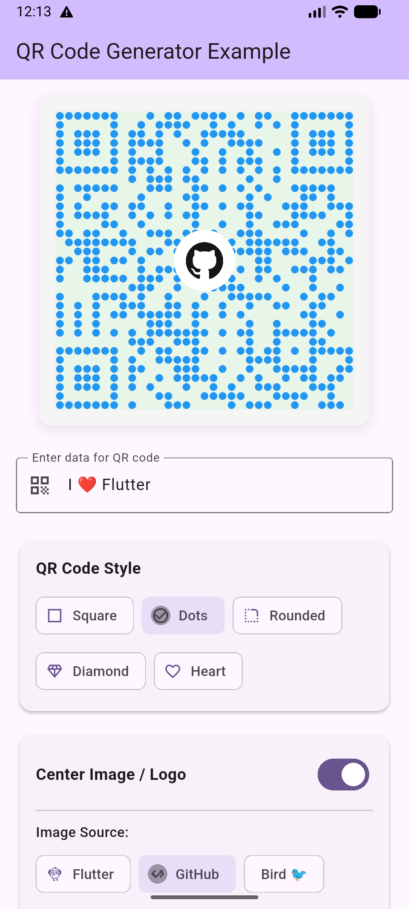
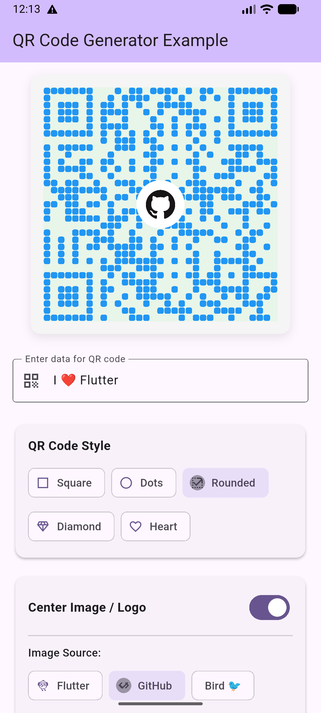
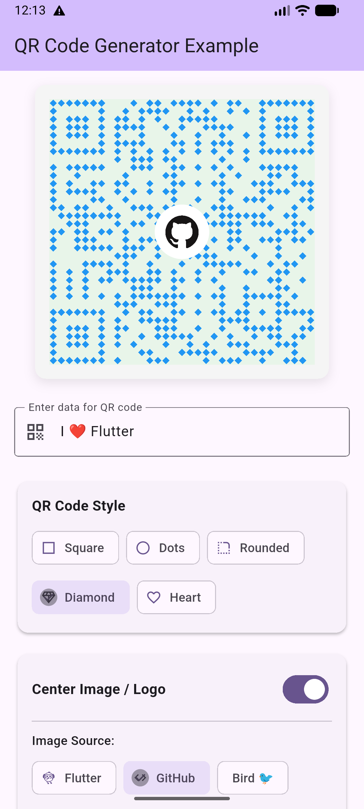
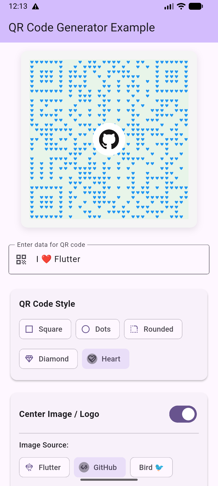

# QR Code Generator

A Flutter package for generating dynamic QR codes with custom colors, optional center images, and multiple styling options using CustomPainter.

<p align="center">



</p>

<p align="center">



</p>

<p align="center">


</p>

## ✨ Features

- 🎨 Generate QR codes from any string data
- 🌈 Customize dark and light colors
- 📏 Adjustable size
- 🖼️ **Optional circular center image/logo**
- 🎯 **Customizable center image border**
- ✨ **Multiple QR code styles**: Square, Dot, Rounded, Diamond, Heart
- 🎭 **Adjustable module gaps** for modern dot/rounded styles
- 🪶 Lightweight implementation using CustomPainter
- ✅ Built-in error handling with smart error correction
- 📱 Works with Asset, Network, File, and Memory images

## 📦 Installation

Add this to your package's `pubspec.yaml` file:
```yaml
dependencies:
  qr_code_generator: ^1.0.2
```

Then run:
```bash
flutter pub get
```

## 🚀 Usage

Import the package:
```dart
import 'package:qr_code_generator/qr_code_generator.dart';
```

### Basic QR Code
```dart
DynamicQrPainterWidget(
  data: 'https://example.com',
  size: 200,
)
```

### With Custom Colors
```dart
DynamicQrPainterWidget(
  data: 'Hello, World!',
  size: 250,
  darkColor: Colors.blue,
  lightColor: Colors.yellow,
)
```

### Dot Style QR Code
```dart
DynamicQrPainterWidget(
  data: 'https://flutter.dev',
  size: 300,
  moduleShape: QrModuleShape.dot,
  darkColor: Colors.blue,
  lightColor: Colors.blue.shade50,
)
```

### Rounded Style QR Code
```dart
DynamicQrPainterWidget(
  data: 'https://flutter.dev',
  size: 300,
  moduleShape: QrModuleShape.rounded,
  moduleGap: 0.15,
  darkColor: Colors.purple,
)
```

### With Center Image (Asset)
```dart
DynamicQrPainterWidget(
  data: 'https://flutter.dev',
  size: 300,
  centerImage: AssetImage('assets/logo.png'),
  centerImageSize: 60,
)
```

### With Center Image (Network)
```dart
DynamicQrPainterWidget(
  data: 'https://github.com/rasel2510',
  size: 300,
  centerImage: NetworkImage('https://example.com/logo.png'),
  centerImageSize: 70,
  centerImageBorderColor: Colors.white,
  centerImageBorderWidth: 6,
)
```

### Dot Style with Logo
```dart
DynamicQrPainterWidget(
  data: 'https://flutter.dev',
  size: 300,
  moduleShape: QrModuleShape.dot,
  moduleGap: 0.15,
  darkColor: Colors.blue,
  lightColor: Colors.blue.shade50,
  centerImage: NetworkImage('https://example.com/logo.png'),
  centerImageSize: 70,
  centerImageBorderColor: Colors.white,
  centerImageBorderWidth: 8,
)
```

### Fully Customized
```dart
DynamicQrPainterWidget(
  data: 'https://pub.dev',
  size: 350,
  moduleShape: QrModuleShape.rounded,
  moduleGap: 0.1,
  darkColor: Colors.deepPurple,
  lightColor: Colors.purple.shade50,
  centerImage: AssetImage('assets/avatar.png'),
  centerImageSize: 80,
  centerImageBorderColor: Colors.white,
  centerImageBorderWidth: 8,
)
```

### Complete Example
```dart
import 'package:flutter/material.dart';
import 'package:qr_code_generator/qr_code_generator.dart';

class QrCodeScreen extends StatelessWidget {
  @override
  Widget build(BuildContext context) {
    return Scaffold(
      appBar: AppBar(
        title: Text('QR Code Generator'),
      ),
      body: Center(
        child: Column(
          mainAxisAlignment: MainAxisAlignment.center,
          children: [
            // Basic Square QR Code
            DynamicQrPainterWidget(
              data: 'https://flutter.dev',
              size: 200,
            ),
            
            SizedBox(height: 40),
            
            // Dot Style QR Code with Logo
            DynamicQrPainterWidget(
              data: 'https://flutter.dev',
              size: 250,
              moduleShape: QrModuleShape.dot,
              moduleGap: 0.15,
              darkColor: Colors.blue,
              lightColor: Colors.blue.shade50,
              centerImage: AssetImage('assets/flutter_logo.png'),
              centerImageSize: 60,
              centerImageBorderColor: Colors.white,
              centerImageBorderWidth: 6,
            ),
            
            SizedBox(height: 40),
            
            // Rounded Style
            DynamicQrPainterWidget(
              data: 'https://github.com',
              size: 250,
              moduleShape: QrModuleShape.rounded,
              darkColor: Colors.black,
            ),
          ],
        ),
      ),
    );
  }
}
```

## 📋 Parameters

| Parameter | Type | Default | Description |
|-----------|------|---------|-------------|
| `data` | `String` | required | The data to encode in the QR code |
| `size` | `double` | `200` | The size of the QR code (width and height) |
| `darkColor` | `Color` | `Colors.black` | Color for dark modules |
| `lightColor` | `Color` | `Colors.white` | Color for light modules/background |
| `moduleShape` | `QrModuleShape` | `square` | Shape style: square, dot, rounded, diamond, heart |
| `moduleGap` | `double` | `0.1` | Gap between modules (0.0-0.3 recommended) |
| `centerImage` | `ImageProvider?` | `null` | Optional circular image in center |
| `centerImageSize` | `double?` | 20% of size | Size of the center image |
| `centerImageBorderColor` | `Color` | `Colors.white` | Border color around center image |
| `centerImageBorderWidth` | `double` | `4` | Border width around center image |

## 🎨 QR Code Styles

### Available Shapes

| Style | Description | Best For |
|-------|-------------|----------|
| `QrModuleShape.square` | Classic square modules (default) | Maximum compatibility, traditional look |
| `QrModuleShape.dot` | Circular dots | Modern, friendly designs |
| `QrModuleShape.rounded` | Rounded corner squares | Soft, approachable look |
| `QrModuleShape.diamond` | Diamond/rotated squares | Unique, geometric designs |
| `QrModuleShape.heart` | Heart-shaped modules | Decorative, romantic themes |

### Style Examples
```dart
// Square (Classic)
QrModuleShape.square

// Dots (Modern)
moduleShape: QrModuleShape.dot,
moduleGap: 0.15,

// Rounded (Friendly)
moduleShape: QrModuleShape.rounded,
moduleGap: 0.1,

// Diamond (Unique)
moduleShape: QrModuleShape.diamond,
moduleGap: 0.1,

// Heart (Decorative)
moduleShape: QrModuleShape.heart,
moduleGap: 0.1,
```

## 💡 Tips

### Scannable QR Codes with Center Images

QR codes have built-in error correction that allows up to 30% of the code to be obscured while still remaining scannable. For best results:

- Keep `centerImageSize` between 15-25% of the QR code size
- The package automatically adjusts error correction based on image size
- Use `moduleGap` of 0.1-0.2 for dot/rounded styles
- Set `moduleGap` to 0 for square/diamond/heart styles
- Test scanning in different lighting conditions and distances

### Module Gap Guidelines

- **Square style**: `moduleGap: 0` (no gap needed)
- **Dot style**: `moduleGap: 0.15` (creates nice spacing between dots)
- **Rounded style**: `moduleGap: 0.1` (subtle gaps for smooth look)
- **Diamond style**: `moduleGap: 0.05` (minimal gap)
- **Heart style**: `moduleGap: 0.1` (prevents overlapping)

### Image Types Supported

You can use any `ImageProvider`:
```dart
// Asset Image
centerImage: AssetImage('assets/logo.png')

// Network Image
centerImage: NetworkImage('https://example.com/logo.png')

// File Image
centerImage: FileImage(File('/path/to/image.png'))

// Memory Image
centerImage: MemoryImage(uint8list)
```

### Styling Best Practices

1. **For maximum scannability**: Use square style with no center image
2. **For modern branding**: Use dot style with company logo
3. **For soft designs**: Use rounded style with pastel colors
4. **For unique look**: Combine diamond style with bold colors
5. **For decorative purposes**: Heart style works great for events/cards

## 🔧 Dependencies

This package depends on:
- [qr](https://pub.dev/packages/qr) ^3.0.1 - For QR code generation

## 📄 License

MIT License

## 🤝 Contributing

Contributions are welcome! Please feel free to submit a Pull Request.

## 📧 Support

For issues, questions, or suggestions, please file an issue on [GitHub](https://github.com/rasel2510/qr_code_generator/issues).

## 🌟 Show Your Support

Give a ⭐️ if this project helped you!

---

Made with ❤️ by [Rasel2510](https://github.com/rasel2510)